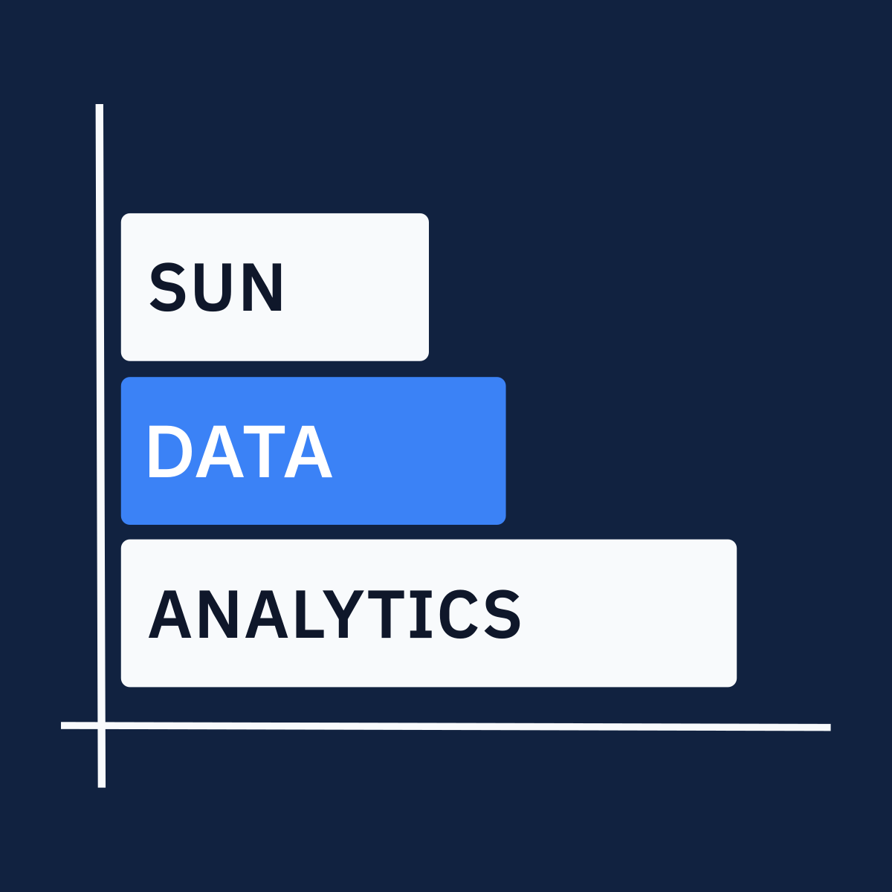
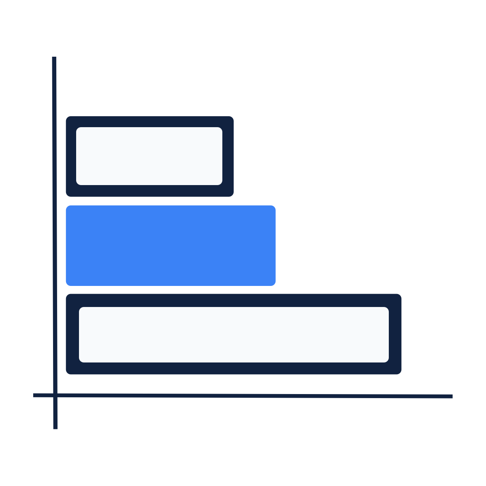

```{=html}
<style>
#title-block-header {
  display: none;
}
</style>

<div class="home-title-lockup">
  
  <h1>Sun Data Analytics</h1>
</div>
```

Sun Data Analytics is an independent analytics studio and public portfolio for practical data projects. I build reports, dashboards, tools, and workflows that make messy information easier to understand and use.

## Featured Work

```{=html}
<section class="front-page-work" aria-label="Featured work">
  <a class="lead-work-card content-card" href="pages/portfolio.html">
    <div class="lead-work-visual" aria-hidden="true">
      <!-- Replace this branded placeholder with a report/dashboard image when one is available. -->
      
    </div>
    <div class="lead-work-copy">
      <p class="content-eyebrow"><span class="content-type">Featured Report</span></p>
      <h3>Creator Performance Report</h3>
      <p class="content-summary">A recurring analytics report that turns platform data into a clearer picture of audience behavior, content performance, revenue patterns, and publishing strategy.</p>
    </div>
  </a>

  <div class="side-work-list">
    <a class="content-card compact-work-card" href="pages/tools-data.html">
      <p class="content-eyebrow"><span class="content-type">Data Workflow</span></p>
      <h3>Automated Data Collection</h3>
      <p class="content-summary">Repeatable workflows for collecting, cleaning, and organizing exports, APIs, transcripts, and public data.</p>
    </a>

    <a class="content-card compact-work-card" href="pages/portfolio.html">
      <p class="content-eyebrow"><span class="content-type">Research System</span></p>
      <h3>Qualitative Coding Pipeline</h3>
      <p class="content-summary">Tools for turning transcripts, open-ended responses, and messy text into structured findings.</p>
    </a>

    <a class="content-card compact-work-card" href="pages/insights.html">
      <p class="content-eyebrow"><span class="content-type">Methods Note</span></p>
      <h3>How to Read Creator Analytics</h3>
      <p class="content-summary">Plain-language notes on metrics, charts, assumptions, and interpretation.</p>
    </a>
  </div>
</section>
```

## Latest From the Studio

```{=html}
<section class="latest-strip" aria-label="Latest from the studio">
  <a class="content-card latest-card" href="pages/insights.html">
    <p class="content-eyebrow"><span class="content-type">Insight</span></p>
    <h3>What descriptive statistics can and cannot tell you</h3>
  </a>

  <a class="content-card latest-card" href="pages/insights.html">
    <p class="content-eyebrow"><span class="content-type">Report Design</span></p>
    <h3>Making creator reports easier to interpret</h3>
  </a>

  <a class="content-card latest-card" href="pages/insights.html">
    <p class="content-eyebrow"><span class="content-type">Data Collection</span></p>
    <h3>Why repeatable workflows matter more than one-off dashboards</h3>
  </a>

  <a class="content-card latest-card" href="pages/portfolio.html">
    <p class="content-eyebrow"><span class="content-type">Portfolio</span></p>
    <h3>Selected projects across dashboards, reports, and research systems</h3>
  </a>
</section>
```

## About the Work

Sun Data Analytics sits between consulting, research, and public data work. Some projects are built for clients. Others are portfolio pieces, experiments, or notes that document how the analysis was made.

The common thread is practical interpretation: collecting the right data, cleaning it carefully, building useful outputs, and explaining what the results mean.

## Hire Me

```{=html}
<section class="hire-card-grid" aria-label="Services">
  <article class="content-card hire-card">
    <p class="content-eyebrow"><span class="content-type">Service</span></p>
    <h3>Reporting Systems</h3>
    <p class="content-summary">Build dashboards, recurring reports, metric definitions, and refresh workflows that make routine reporting easier to trust.</p>
  </article>

  <article class="content-card hire-card">
    <p class="content-eyebrow"><span class="content-type">Service</span></p>
    <h3>Data Collection and Workflow Automation</h3>
    <p class="content-summary">Turn scattered exports, API pulls, transcripts, and spreadsheets into cleaner, repeatable analysis materials.</p>
  </article>

  <article class="content-card hire-card">
    <p class="content-eyebrow"><span class="content-type">Service</span></p>
    <h3>Research, Evaluation, and Mixed-Methods Analysis</h3>
    <p class="content-summary">Design practical analyses, code qualitative data, classify text, and connect findings to decisions.</p>
  </article>
</section>
```

If you need a cleaner report, a dashboard people can actually use, a repeatable data workflow, or help turning research material into findings, contact [jonathonsun03@gmail.com](mailto:jonathonsun03@gmail.com).
